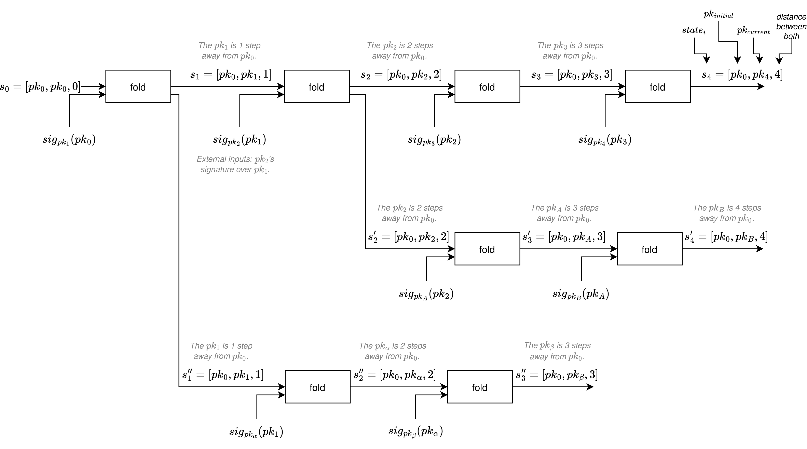

# ethdos-fold
Follows the ideas of ETHdos (https://ethdos.xyz/blog), but using folding schemes.
It uses <a target="_blank" href="https://github.com/privacy-scaling-explorations/sonobe">Sonobe</a> under the hood, compiled to WASM.

## Usage
- requirements: [rust](https://rustup.rs/), [wasm-pack](https://rustwasm.github.io/wasm-pack/installer/)
- run native tests: `cargo test --release -- --nocapture`
- build wasm: `wasm-pack build --target web`
- serve the web: `python -m http.server 8080`
  - go to http://127.0.0.1:8080/index.html


## Main idea
> This section overviews the ETHdos design adapted to the folding schemes IVC model. Read more about ETHdos original design on the original blog post by it's authors: https://ethdos.xyz/blog, which is built using full-recursion with Groth16 proofs.

We have a directed graph of relations between public keys, where each arrow represents a signature.<br>
For example, the signature of $pk_1$ over the $pk_0$, ie. $sig_{pk_1}(pk_0)$, is represented by: $pk_0 \longleftarrow pk_1$.

Let the following diagram be the relation between the public keys:


So for example, in the previous diagram:

- $pk_3$ is 3 degrees of distance from $pk_0$
  - $pk_3$ has signed $pk_2$, who has signed $pk_1$, who has signed $pk_0$
- $pk_B$ is 4 degrees of distance from $pk_0$
  - $pk_B$ has signed $pk_A$, who has signed $pk_2$, who has signed $pk_1$, who has signed $pk_0$
- $pk_\beta$ is 3 degrees of distance from $pk_0$
  - $pk_\beta$ has signed $pk_\alpha$, who has signed $pk_1$, who has signed $pk_0$

With folding schemes, we can map those relations into an IVC model, where at each recursive step we're proving the [`FCircuit` relation](https://github.com/arnaucube/ethdos-fold/blob/main/src/fcircuit.rs) (key part: the method `EthDosCircuit.generate_step_constraints`), which ensures that the new state ($s_{i+1}$) comes from the previous state ($s_i$) with the verification of the new signature of the $pk_{i+1}$ over the previous public key $pk_i$.


The *state* of the IVC is $s_{i+1} = [pk_0, pk_{i+1}, i+1]$, where $pk_i$ is the public key $i$ degrees of distance from $pk_0$, and $pk_{i+1}$ is $i+1$ degrees of distance from $pk_0$. At each step $i$ we have the IVC proof $\pi_i$, which proves this relation.

The following diagram shows the relation between the states and signatures at each folding step, showing also divergent paths.



Each new folding step, only needs to have the previous step's state ($s_i = [pk_0, pk_i, i]$) and the respective IVC proof ($\pi_i$), which proves that the given public key $pk_i$ is $i$ degrees of distance from the public key $pk_0$.
A new recursive step is done from the $\pi_i$ and the $s_i$, and by inputting the new signature $sig_{pk_{i+1}}(pk_i)$, which is at degree of distance $i+1$ from $pk_0$.

Notice that in order to generate the proof of relations between different public keys, it is not necessary to know any of their private keys, but just by knowing their public keys and having their signatures suffices to generate the proofs. So for example the signatures could be publicly accessible, and any user could just fetch them to generate their specific proofs of degrees of distance from other keys.


## Code structure

As you can see, thanks to the simplicity & modularity of Sonobe and arkworks, this whole implementation reduces to defining the [`FCircuit` trait](https://github.com/arnaucube/ethdos-fold/blob/main/src/fcircuit.rs), which takes less than 70 lines of code, the key part being the method `generate_step_constraints` which takes <40 lines of code.

Additionally, we can swap between folding schemes:

With Sonobe we define the Folding Scheme being used at the line (file `src/lib.rs`):
```rust
type FS = Nova<G1, G2, FC, Pedersen<G1>, Pedersen<G2>>;
```
which we could switch it to use HyperNova, is as simple as updating the previous line to:

```rust
type FS = HyperNova< G1, G2, FC, Pedersen<G1>, Pedersen<G2>, 1, 1>;
```

similarly we can switch to using ProtoGalaxy folding scheme:
```rust
type FS = ProtoGalaxy<G1, G2, FC, Pedersen<G1>, Pedersen<G2>>;
```

And the rest of the code would remain the same, while using a completely different folding scheme.

We can also use any arkworks available cycle of curves at the `G1` and `G2`, the current implementation uses BN254 and Grumpkin curves, since we're verifying EdDSA signatures over the BabyJubJub curve.


## Some numbers
> Current numbers using the Sonobe version at commit `c6f1a246e0705582a75de6becf4ad21f325fa5a1`.

Thinkpad laptop, i7-1270P, 16 cores:

- native: `~290ms` per step
- in-browser: `~2.2s` per step

Other numbers: due the fixed overhead of folding, current implementation folding 1 single signature per folding step is not ideal. To get more 'real' values, the repo https://github.com/arnaucube/fold-babyjubjubs contains a similar implementation but that performs multiple signature verifications per each folding step, amortizing better the fixed folding costs, reducing the time per signature substantially (eg. on the same laptop it takes `~45ms` per signature in the folding step).


## Acknowledgements
Thanks to Michael Chu for proposing to build this prototype. This repo uses [Sonobe](https://github.com/privacy-scaling-explorations/sonobe), which relies on [arkworks-rs](https://github.com/arkworks-rs), and for the BabyJubJub EdDSA it uses [kilic/arkeddsa](https://github.com/kilic/arkeddsa). Thanks also to the [ETHdos](https://ethdos.xyz/blog) authors, the idea is very cool.
